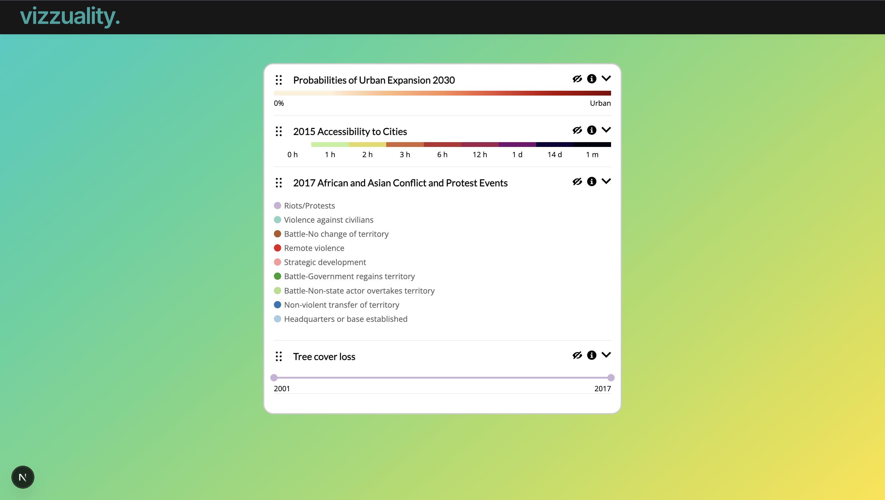

## Getting Started

1. Clone the repo:

```bash
git clone git@github.com:filipacotrim/vizzuality-challenge.git
```

2. Move to the main directory:

```bash
cd legend-vizz
```

3. Run the development server:

```bash
npm run dev
# or
yarn dev
# or
pnpm dev
# or
bun dev
```

4. Visit [deployed app](https://vizzuality-challenge.vercel.app/)!



## Functionality 

This project is a simple Legend component application, based on the designs available in [Figma](https://www.figma.com/design/CcReFFvkqC2FZoCi8yiGhb/Code-Challenge?node-id=0-1&p=f&t=dwYzUdzZhaLsHKjW-0) and following the [guidelines provided](https://github.com/Vizzuality/front-end-code-challenge/blob/master/junior-mid/README.md). It emcompasses four distinct layers (**basic**, **choropleth**, **gradient** and **timeline**). For each, there's the option to **collapse/expand**, **view more info**, as well as **show/hide** layers.

Additional enhancements include an informational modal that appears when the user requests more details. The modal can be dismissed intuitively by clicking outside of it, improving usability. Furthermore, tooltips are automatically disabled on touch devices to ensure a better mobile experience and avoid interaction conflicts. Drag and drop is available, allowing the user to order the layers as they see fit. 

The application is fully responsive and designed to work across all screen sizes. Responsiveness was considered throughout the implementation, including adaptive text sizing and dynamic positioning of modal components, to ensure a consistent and accessible user experience on both desktop and mobile devices.

## Architecture
 
This project was built with [Next.js](https://nextjs.org/docs) on top of [React](https://react.dev/) and follows a clear separation between Server Components and Client Components to balance performance and interactivity.

We fetch the data currently in ``` data.json``` from the API, simulating a REST endpoint, as to improve performance and reduce client-side bundle size.

Overall the architecture prioritizes:
1. Clear separation of concerns
2. Controlled component patterns 
3. Server-side data fetching
4. Client-isolated interactivity 

Client-side components are organized inside the ```public/components``` directory and grouped by responsibility:
- ```components/header/```: Contains the shared Header UI components used across different layer types.
- ```components/layers/```: Contains layer-specific components, each encapsulating its own rendering logic.

This structure keeps shared UI elements separate from feature-specific components, improving maintainability, scalability, and readability. It also ensures that reusable logic (like the Header) remains decoupled from layer implementations.

## Deployment

Although GitHub Pages is an easy option for deployment, it only supports static hosting. Since this project required dynamic data fetching, where the data is loaded at runtime rather than bundled at build time, GitHub Pages would not reliably handle server-side API requests. To maintain true interactivity and dynamic loading, the project was deployed to Vercel, which supports server-side rendering and API routes, allowing the app to fetch data dynamically both locally and in production.

## Additional Notes

The navigation bar features a logo derived from an exported SVG of the company’s publicly available logo ([source here ↗︎](https://brandfetch.com/vizzuality.com)). The background gradient was inspired by Vizzuality’s website and visual elements, with colors and styling adapted through careful inspection of their existing branding. Lastly, the favicon shown in the browser tab was designed by me in [Figma](https://www.figma.com/design/Fj78DJzOmOxZXdM6DaZcPe/Untitled?node-id=2-7&t=RPEIoBAiW9M9J7CE-1) to match the main logo and overall aesthetic.

The main challenges were implementing drag-and-drop without causing hydration mismatches in Next.js and ensuring full responsiveness. Drag listeners were applied only after the component mounted on the client to avoid server/client mismatches, while layout, text sizing, and modals were carefully adapted for different screen sizes and touch devices.

Another challenge was deploying the project. GitHub Pages was difficult to configure due to Next.js’ static export behavior, base paths, and folder structure, which caused missing assets and 404 errors. Vercel worked better, but required careful setup and understanding that server-side fetching of local API routes cannot be done during static export — only client-side fetching or direct imports work reliably.

<br>
<br>

Solution done by **Filipa Cotrim** for **Vizzuality** :)

